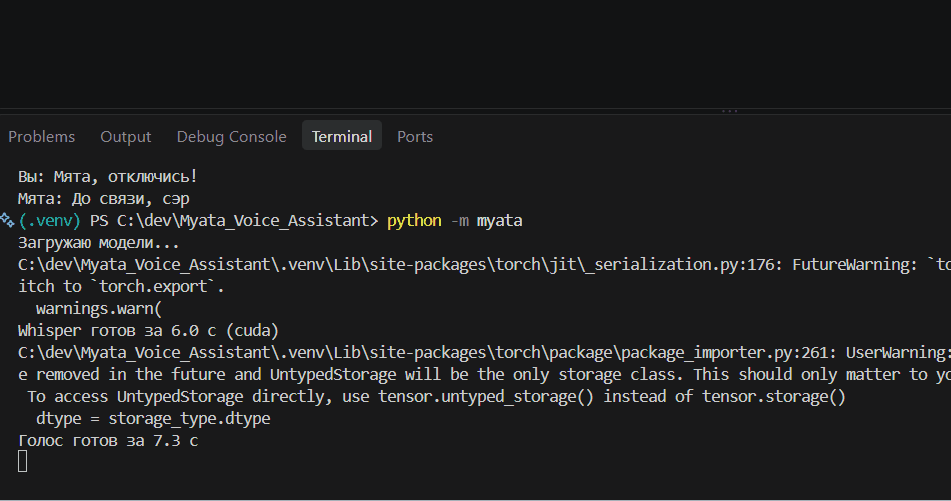
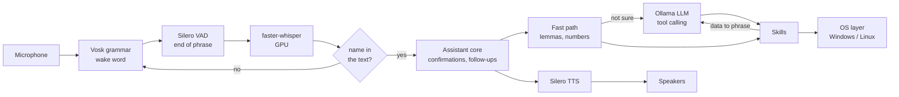
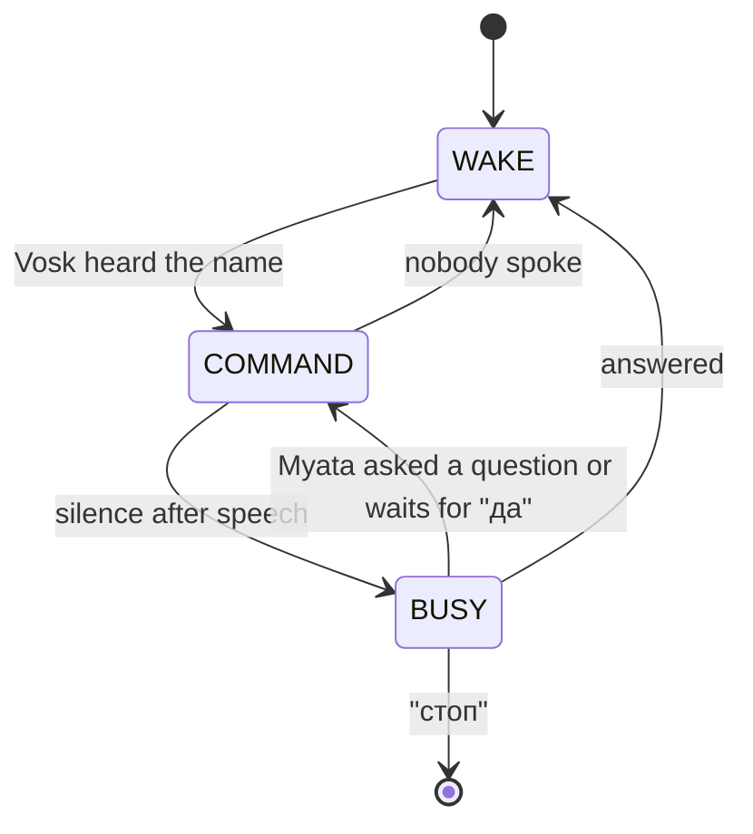

# Myata (Мята): an offline voice assistant that speaks Russian

[](https://github.com/Nurikoks/Myata_Voice_Assistant/actions/workflows/ci.yml)


[](LICENSE)

Myata is a Jarvis-style voice assistant for the desktop. You say
"Мята, открой дискорд и стим", and she opens both apps and answers in her own voice.
Wake word, speech recognition, the language model and the voice all run locally
on a laptop with an 8 GB GPU. No cloud services and no API keys.



## Highlights

- **Fully local.** Every model runs on your machine. Only skills that need the
  internet by nature (web search) go online.
- **Hybrid brain.** A deterministic fast path (word lemmas, numbers as arguments)
  answers known commands almost instantly. Free-form phrases go to a local LLM
  (Qwen 3.5 4B through Ollama) with tool calling.
- **Safe by design.** The LLM can only call registered skills, and their arguments
  are checked against a JSON schema. Shutting down the computer needs a spoken "да".
  Copied text is summarized by the LLM with no tools available.
- **Two-stage wake word.** A tiny Vosk grammar reacts to "Мята" right away, and
  Whisper has to hear the name too, which removes false wake-ups.
- **Cross-platform.** Windows and Linux. All OS-specific code lives in one package,
  and a skill is only registered where it can work.
- **Tested.** 150+ tests run in CI on Windows and Ubuntu, without a microphone,
  a GPU or any model files.

## What she can do

| Area | Example phrases |
| --- | --- |
| Apps and websites | «открой ютуб», «запусти стим», «найди на ютубе лоу-фай» |
| Sound | «громче», «громкость 30», «выключи звук», «пауза», «следующий трек» |
| Computer | «выключи компьютер», «спящий режим» (always asks to confirm) |
| Notes and clipboard | «запиши купить молоко», «что в заметках», «переведи то, что я скопировал» |
| Scenes | «игровой режим» starts Discord and Steam and sets the volume |
| Conversation | small talk, follow-up questions, «ещё раз», several actions in one phrase |

Websites, apps and scenes are plain entries in `config.yaml`, no code needed.

## Architecture



The assistant core works on text only. The voice loop feeds it recognized phrases,
and the text mode (`--text`) feeds it typed lines, so all of the logic is tested
without audio.

### Voice loop



In WAKE only the cheap spotter runs, and the last second of audio is kept, so
"Мята, открой ютуб" said in one breath is not cut. In BUSY the microphone is
muted, so Myata never hears her own voice.

## Tech stack

| Part | Choice | Notes |
| --- | --- | --- |
| Wake word | Vosk `small-ru` with a one-word grammar | CPU, about 50 MB |
| End of phrase | Silero VAD | CPU, a 2 MB TorchScript file |
| Speech to text | faster-whisper, Russian fine-tune of large-v3-turbo | GPU, int8_float16, about 1.5 GB VRAM |
| Language model | Ollama + qwen3.5:4b, tool calling, thinking off | GPU, about 4 GB VRAM |
| Fast path | own router + pymorphy3 | no model, a few milliseconds |
| Text to speech | Silero v5_ru, pyttsx3 as fallback | CPU |
| Config | YAML into frozen dataclasses | unknown keys and wrong types are errors |
| Quality | ruff, pytest, GitHub Actions | Windows and Ubuntu, Python 3.11 and 3.13 |

Whisper, the LLM and Windows itself fit together into 8 GB of VRAM. At startup
Myata shows how much of the LLM sits on the GPU and warns if Ollama had to move
part of it to the CPU.

## Getting started

### Windows

```powershell
py -3.13 -m venv .venv
.venv\Scripts\Activate.ps1
python -m pip install --upgrade pip
pip install torch --index-url https://download.pytorch.org/whl/cpu
pip install -e ".[dev,voice]"
```

torch is installed from the CPU index on purpose: Silero runs on the CPU, and
Whisper uses the GPU through CTranslate2 with the `nvidia-cublas-cu12` and
`nvidia-cudnn-cu12` packages, not through torch.

Install [Ollama](https://ollama.com/download) and pull the model:

```powershell
ollama pull qwen3.5:4b
```

Download the models into `models/`:

```powershell
New-Item -ItemType Directory -Force models\silero | Out-Null
Invoke-WebRequest https://raw.githubusercontent.com/snakers4/silero-vad/master/src/silero_vad/data/silero_vad.jit -OutFile models\silero\silero_vad.jit
Invoke-WebRequest https://models.silero.ai/models/tts/ru/v5_ru.pt -OutFile models\silero\v5_ru.pt
python -c "from huggingface_hub import snapshot_download; snapshot_download('coriollon/whisper-large-v3-turbo-russian', local_dir='models/whisper-turbo-ru', allow_patterns=['ct2_int8_float16/*', 'preprocessor_config.json', 'tokenizer.json'])"
```

Then get `vosk-model-small-ru-0.22` from https://alphacephei.com/vosk/models
and unzip it to `models/vosk-model-small-ru-0.22`.

### Linux Mint 22

```bash
sudo apt install python3-venv libportaudio2 espeak-ng libespeak1 pulseaudio-utils playerctl xclip
python3 -m venv .venv
source .venv/bin/activate
python -m pip install --upgrade pip
pip install torch --index-url https://download.pytorch.org/whl/cpu
pip install -e ".[dev,voice]"
curl -fsSL https://ollama.com/install.sh | sh
ollama pull qwen3.5:4b
```

Install the NVIDIA driver through Driver Manager first. The CUDA libraries for
Whisper come from pip and Myata loads them herself, no `LD_LIBRARY_PATH` needed.
Download the models the same way as on Windows (`wget -O` instead of
`Invoke-WebRequest`). Screenshots need an X11 session, which is the Mint default.
Check the Linux commands of your apps in `config.yaml`: Flatpak apps start with
`flatpak run <app id>`.

### Run

```powershell
python -m myata                 # voice mode
python -m myata --text          # type commands, no microphone needed
python -m myata --text --speak  # type commands, hear the answers
python -m myata --no-llm        # fast commands only, without Ollama
python -m myata --list-skills   # what Myata can do on this OS
python -m myata --list-devices  # microphones and speakers
```

Settings, phrases, models, the voice, websites, apps and scenes are in
`config.yaml`. Notes are saved to `data/notes.md`, logs to `logs/myata.log`
(including the time every phrase took).

## Project layout

```
myata/
  __main__.py   command line entry point
  app.py        wires everything together, loads models in parallel
  config.py     config.yaml into typed dataclasses with strict validation
  core/         assistant logic: confirmations, follow-ups, "ещё раз"
  brain/        fast router, word forms, LLM client, dialog history, prompt
  skills/       registry, built-in skills, skills and scenes from config
  voice/        voice loop state machine (wake, record, busy)
  wake/         Vosk wake word spotter, wake word check in the text
  stt/          Silero VAD and faster-whisper
  tts/          Silero TTS, pyttsx3 fallback, text normalization
  audio/        microphone with mute, speaker output
  oslayer/      everything OS-specific (Windows, Linux, CUDA libraries)
tests/          tests that need no microphone, GPU or models
```

## Adding a skill

Create a file in `myata/skills/builtin/`:

```python
from myata.skills.base import SkillContext, SkillResult
from myata.skills.registry import skill


@skill(name="say_hello", description="Greet the user", phrases=["привет"])
def say_hello(ctx: SkillContext) -> SkillResult:
    return SkillResult("Привет, сэр")
```

It is picked up automatically: the fast path learns its phrases, and the LLM
gets it as a tool. A skill can also

- take arguments from the LLM (`parameters=` with a JSON schema, validated before it runs),
- take a number straight from the fast path (`number_arg="level"`),
- ask for a spoken confirmation (`dangerous=True`),
- need an OS capability (`requires=[VOLUME]`), so it is skipped where that is missing,
- return `SkillResult(speech, data=...)`, so the LLM phrases the answer from the data.

Anything OS-specific goes into `myata/oslayer/`.

## Development

```powershell
pytest
ruff check .
```

CI runs both on every push and pull request.

## Roadmap

- weather, timers and reminders, system status (CPU, RAM, GPU)
- interrupting Myata while she talks
- streaming LLM answers into the voice, so long answers start sooner

## Licenses

The code is MIT licensed, see [LICENSE](LICENSE). The models have their own licenses:

| Model | License |
| --- | --- |
| [Silero TTS](https://github.com/snakers4/silero-models) | CC BY-NC 4.0, non-commercial use only |
| [Silero VAD](https://github.com/snakers4/silero-vad) | MIT |
| [Vosk small-ru](https://alphacephei.com/vosk/models) | Apache 2.0 |
| [Whisper large-v3-turbo, Russian fine-tune](https://huggingface.co/coriollon/whisper-large-v3-turbo-russian) | Apache 2.0 |
| Qwen 3.5 4B | see the model page on [ollama.com](https://ollama.com/library/qwen3.5) |

Model files are not part of this repository and are downloaded separately.
